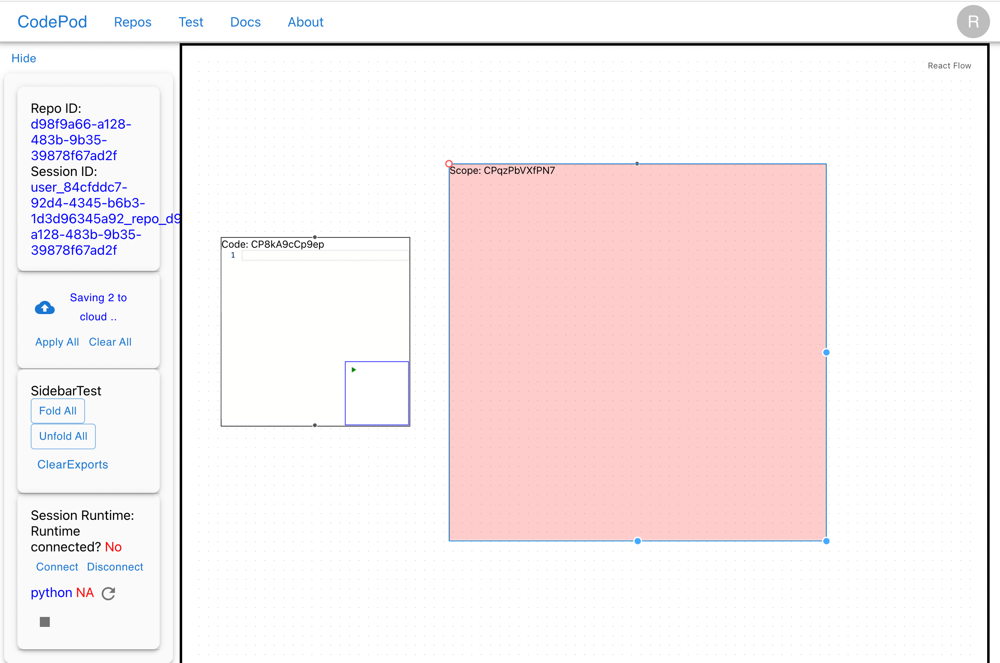
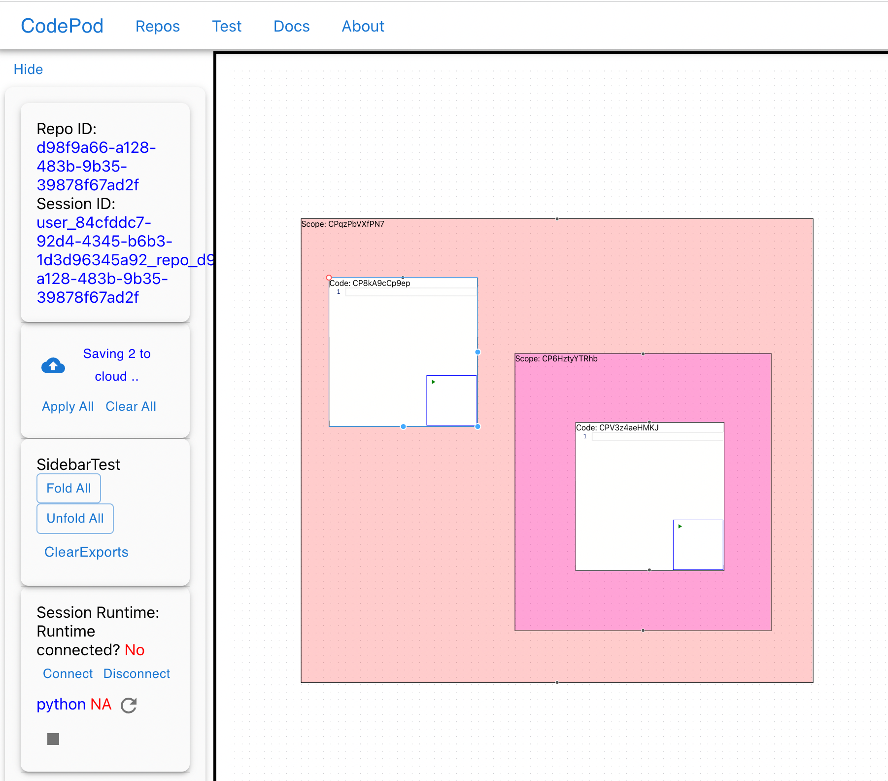

# Tutorial

## Tutorial

:::caution Deprecated

This document was for CodePod v0.4.2. Much has been changed afterwards.

:::

The new graph-based interface provides a more intuitive way to develop your project in CodePod.

**Try it [here](https://app.codepod.io)**

You will need to signup and signin to the site.

After login, go to the repos page, and **create a repo**:

Click on the newly created repo and you'll be greeted with an empty canvas. **Right click** on the canvas to create nodes.

Two nodes are available:

- `code`: this is a code editor for you to write code. Try type in the editor!
- `scope`: the scope defines namespaces, think of it as a module.

You can freely **move code into scopes**, possibly nested.

:::tip

- For `code` nodes, try drag on the name.
- You can resize the nodes using the handles on the bottom right.

:::

Finally, click the **save to cloud** button to save your project. You can come back to visit it at any time.

## Facts and known issues

This version is deployed on k8s. Known issue: the k8s runtime is not working
yet.
